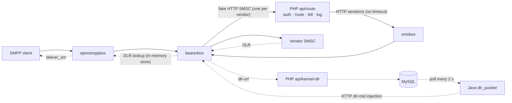
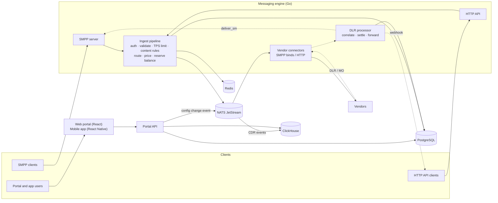

# Telivoz SMS Gateway — Modernization Plan

**Status:** Draft v1 for review · **Date:** 9 October 2026 · **Scope:** plan only, no code changes yet

Prepared from the source in `sms-master (1).zip` and `KANNEL SMS GATEWAY issues.docx`. Some production pieces are not in the zip (listed in §2.1), so parts of the current-flow description are reconstructed from the code and the issues document and must be confirmed against the live server in Phase 0.

---

## 1. Summary

The current gateway is about five years old. It runs Kannel (bearerbox, smsbox, opensmppbox, sqlbox), a Yii2 PHP portal, a Java DLR pusher and MySQL/MariaDB. The reported problems come from specific design choices in the code:

- **Every message takes an extra HTTP round trip.** Kannel calls PHP synchronously for each message (the "internal route"), and PHP calls back into Kannel to reach the real vendor. When PHP is slow, Kannel treats the reply as a failure and retries. This causes duplicate messages and double billing, and it caps TPS.
- **Nothing in the database stops a message being stored and charged twice.** There is no unique key on the client's message ID.
- **Configuration changes restart Kannel, and DLR matching lives in memory.** Any routing or vendor change triggers a full Kannel restart, and Kannel keeps its DLR mappings in memory, so DLRs are lost.
- **An unresponsive vendor keeps getting the same message.** Vendor acknowledgement timeouts are set to re-queue.
- **Bulk sending and DLR forwarding are slow polling loops.** They use sleeps, have no timeouts, and run expensive queries on large tables.

### Recommendation: two tracks

| Track | What | Duration (indicative) |
|---|---|---|
| **A. Stabilize now** | Targeted configuration, database and code fixes on the current system. They stop duplicates, lost DLRs and runaway resends while the new platform is built. | 1–2 weeks |
| **B. New platform** | Replace Kannel and the PHP routing with one purpose-built engine in **Go**. Build a completely new, modern web portal in **React + TypeScript + Tailwind CSS**, plus an optional **React Native** mobile app (§5). Use **PostgreSQL** for transactions, **ClickHouse** for Alaris-style analytics, **NATS JetStream** as the durable queue and **Redis** for caching and rate limits. Migrate clients and vendors gradually and keep the old system as a fallback. | ~5–6 months |

**Targets for the new platform:**

- 300 TPS sustained, with headroom to at least 1,000 TPS on the existing server.
- Zero duplicate charges.
- No DLRs lost across restarts.
- DLR forwarding p95 under 1 second.
- Routing, rate and vendor changes take effect live, without restarts.

---

## 2. Current system (as found in the code)

### 2.1 Components

| Component | Technology | Role |
|---|---|---|
| bearerbox, smsbox, opensmppbox, sqlbox | Kannel (C) | SMPP to clients (opensmppbox), SMPP to vendors (bearerbox), HTTP `sendsms` (smsbox) |
| Portal | PHP, Yii 2.0.14, Bootstrap 3, PHPExcel 1.8 | Admin and client UI, HTTP API, internal routing and billing endpoint, generation of Kannel SMSC config files |
| Console jobs | PHP via cron | Bulk dispatcher, DLR processor, archiving, Kannel restart, gateway monitor, schedulers |
| DLR pusher | Java with commons-dbcp 1 and log4j 1.x | Polls `delivery_reports` every 2 s and pushes DLRs to clients |
| Database | MySQL/MariaDB, 118 tables | Configuration, messages, DLRs, billing, reports |

**Not in the provided source (needed in Phase 0):**

- Live Kannel configs: `kannel.conf`, opensmppbox, sqlbox, SMSC include files and `smsbox-route.conf`.
- `MessageDispatcherL`, which the daemon-restart command references.
- The component that writes rows into `delivery_reports`.
- The crontab and systemd units.

### 2.2 Current message and DLR flow (SMPP client)



Each SMPP message passes through Kannel twice and PHP once. Each DLR passes through PHP, a MySQL polling loop and Kannel again.

For every message, PHP does the following:

- Runs about 15 or more database queries: eight separate route lookups on a `routes` table with no secondary indexes, plus pricing, balance, debit and insert.
- Downloads and parses Kannel's full `status.xml` before sending.

### 2.3 Other findings

- **Money is stored as `FLOAT`/`DOUBLE`.** This covers rates, credits and balances, so billing has rounding errors.
- **Balance check and debit are two separate steps.** They are not in a transaction, so concurrent sends can overdraw an account.
- **The refund formula differs from the charge formula.** Refunds assume 160 characters per part, but charges handle Unicode, so refunds can be wrong.
- **LCR is not implemented.** The option exists in the UI, but the code stops with debug output when it is selected. "Round robin" always picks the first gateway.
- **`outgoing_sms` writes are slow, and its IDs will run out.** The table has two indexes on the 700-character `message` column and several duplicate indexes. Its `INT` primary key tops out at 2.1 billion.
- **Two DLR processors work on the same table:** the PHP `DeliveryReportsController` and the Java `dlr_pusher`.
- **The DLR archiving job is heavy.** It uses a date filter that cannot use an index and moves rows in one large transaction. Its comment says 21 months, but the code uses 21 days.
- **Kannel SMSC config files are built by string concatenation from form fields.** One line writes `reroute-dlr = 'UTF-8'`, which was probably meant to set `alt-charset`.
- **Libraries are outdated:**
  - Yii 2.0.14 (PHP 5.6 era).
  - PHPExcel 1.8, which is abandoned. Bulk uploads load the whole file into memory.
  - Bootstrap 3.
  - log4j 1.x (end of life) and commons-dbcp 1 in the Java pusher.
  - The Java pusher trusts every TLS certificate.
- **Security needs hardening** across authentication, secret handling and admin actions. Details are shared privately, not in this document.
- **There are almost no tests.** Only the Yii template's sample tests exist.

---

## 3. Reported issues → root cause → fix

| # | Issue (from the issues document) | What the code shows | Stabilize now (Track A) | Permanent fix (Track B) |
|---|---|---|---|---|
| 1 | **Double messages and double billing with the same message ID** | Most likely cause: Kannel calls PHP synchronously for each message, and PHP calls Kannel back without a timeout while Kannel waits. A slow or temp-fail reply makes Kannel retry with the same ID. `outgoing_sms` has no unique key on (client, message ID), so the retry is inserted and charged again. Bearerbox restarts can also re-queue unacknowledged messages. | De-duplicate existing rows, then add a unique key on (client, external message ID). Insert before charging, in one transaction, and return the existing ID on a duplicate. Make the debit atomic and conditional (`balance >= amount`). Add timeouts on the PHP→Kannel calls. Stop fetching `status.xml` for every message. | No internal HTTP hop. Each message gets one ID at ingest. The ledger has a unique (message, charge type) constraint, so a message can never be charged twice. The queue de-duplicates by message ID. |
| 2 | **Bulk messages held for about 2 hours** | The bulk dispatcher is one PHP process that sends one message at a time. For each message it downloads `status.xml`, calls `sendsms` with no timeout (`CURLOPT_TIMEOUT => 0`), saves the row, then sleeps to throttle. One hung call stalls the whole queue, and a failed status fetch kills the batch (`die`). Heavy indexes slow every update. | Add timeouts. Cache SMSC status for a few seconds. Remove `die`. Run one worker per vendor in parallel. Drop the unneeded indexes. Review Kannel queue and throughput settings. | Per-vendor asynchronous workers fed from a durable queue, with windowed SMPP submits. Throttling by token bucket instead of sleep. Uploads processed as background jobs. |
| 3 | **DLR not forwarded, lost on restart, or 20–30 s late** | SMPP DLRs are re-injected into Kannel and matched against Kannel's DLR store. That store is in memory, so a bearerbox restart wipes it, and the portal restarts Kannel on every routing or vendor change. The Java pusher polls every 2 s and sleeps after every batch. It claims rows with an `UPDATE … WHERE … OR …` that has no supporting index on a growing table. Its batches and task queue have no size limit, and stuck rows are only reset at startup. | Move Kannel `dlr-storage` to a database backend (MySQL or Redis). Stop full restarts on configuration changes: use bearerbox per-SMSC admin commands where the installed version supports them, or off-peak windows. Add a composite index for the claim query. Cap the batch size. Don't sleep while work is pending. Fix the archiver. | DLR correlation is stored durably (PostgreSQL with a Redis cache). DLRs are processed as events, with no polling. Each DLR is forwarded on the client's bound session or queued until the client binds. HTTP clients get webhooks with retries. Target: p95 under 1 s. |
| 4 | **Same message sent to the vendor repeatedly (up to ~1000 times)** | The vendor form defaults `wait-ack-expire` to `0x01`. In Kannel that re-queues a message when the vendor doesn't acknowledge, and Kannel's documentation warns it can deliver twice. With unlimited resend retries (Kannel's default when `sms-resend-retry` is not set), a silent vendor gets the same message indefinitely. *Verify against the live config.* | Set `sms-resend-retry` to a small finite number. After testing with each vendor, change `wait-ack-expire` to keep waiting (`0x02`) or reconnect (`0x00`). Alert on acknowledgement timeouts. | An explicit retry policy per vendor: maximum attempts and backoff, and never resubmitting unacknowledged messages beyond the limit. Failover only by rule. Every attempt is recorded. |
| 5 | **Boxes fail and leave no logs** | Boxes are restarted by service auto-restart and a portal button. Crash output is not captured. The portal itself triggers service stop/start. | Give each box its own log file at a suitable level. Capture panics and core dumps. Use systemd `Restart=on-failure` with journald. Alert on every restart. Remove restarts triggered from the web. | One engine with structured logs, metrics, health checks and alerting. Configuration reloads live, so restarts are never part of normal operation. |
| 6 | **Internal routing adds an extra HTTP call** | Confirmed. One fake HTTP SMSC per vendor (`<vendor>_HTTP_API`) calls PHP `api/route`, which calls Kannel `sendsms` to reach the real vendor. Per the original developer, it exists to acknowledge the client, to route, bill and log, and to map IDs for DLRs. It is the TPS ceiling. | Keep it for now and only harden timeouts and indexes. It cannot be removed safely without the new engine. | Replaced by routing and billing inside the engine (§4). Both alternatives proposed by the second developer keep Kannel and database polling at the centre (§4.4). |

---

## 4. Target architecture

### 4.1 Technology choices

| Layer | Choice | Why |
|---|---|---|
| Messaging engine | **Go** | Built for highly concurrent networking. Ships as a single static binary. Has an established SMPP ecosystem. 300 TPS uses a small fraction of the server's 40 threads. Easy to hire for. Rust was considered: it is faster, but slower to build, and the target doesn't need it. |
| Portal and API backend | **Go** (same codebase) | One backend language. Shares models with the engine. Typed SQL (sqlc) and an OpenAPI spec. |
| Web portal | **React + TypeScript + Tailwind CSS**, Vite, shadcn/ui, TanStack Query/Table/Router, Apache ECharts | A fully modern single-page app with a consistent component library and rich charts for Alaris-style analytics. Dark mode, responsive layout, i18n. Details in §5. |
| Mobile app (optional) | **React Native + TypeScript** (Expo), NativeWind (Tailwind for React Native) | Native iOS and Android app with push alerts. Shares TypeScript types, API client, validation and design tokens with the web portal. Details in §5. |
| Transactional database | **PostgreSQL** | Strong constraints and transactions for billing. Native partitioning for message tables. Exact `NUMERIC` money. |
| Analytics database | **ClickHouse** | Sub-second aggregations over billions of CDRs. Materialized rollups for dashboards. |
| Queue | **NATS JetStream** | Durable, with acknowledgement and redelivery, built-in de-duplication by message ID and a small operational footprint. RabbitMQ is an acceptable alternative. Kafka is overkill at this scale. |
| Cache and rate limits | **Redis** (or Valkey) | Route and rate cache, per-client and per-vendor TPS limits, real-time balance counters. |
| Observability | **Prometheus, Grafana, Loki, Alertmanager** | Metrics, dashboards, logs, and alerts by email, Telegram or Slack. |
| Packaging and delivery | **Docker Compose** on the server, **GitHub Actions** CI/CD | Reproducible deploys, with staging identical to production. |

### 4.2 Target flow



### 4.3 How the core guarantees are met

- **One ID per message, charged at most once.** Each message gets a time-ordered ID (UUIDv7) at ingest. The ledger enforces uniqueness on (message ID, entry type), the queue de-duplicates by message ID, and every downstream step is idempotent.
- **Persist before acknowledging.** A client gets `submit_sm_resp` (or HTTP 202) only after the message is persisted and its balance is reserved. If the engine crashes at any point, the message is redelivered and de-duplicated. It is never lost or charged twice.
- **Bounded vendor retries.** Each vendor connection has maximum attempts, backoff and timeout behaviour. Nothing can loop.
- **Durable DLR matching.** The mapping from vendor message ID to our ID is stored before the DLR can arrive. DLRs for clients that are not bound are kept and delivered when they bind, with an expiry.
- **Live configuration.** Changes to routes, rates, vendors and accounts are published as events, and the engine swaps them in memory atomically. Individual vendor binds can be started, stopped or restarted, with no global restart.
- **Backpressure instead of silent backlog.** Each vendor has its own queue and TPS limit. Each client has a TPS limit and gets a proper throttling response (`ESME_RTHROTTLED`) instead of a hidden backlog.

### 4.4 Alternatives considered

| Option | Verdict |
|---|---|
| A. Keep Kannel and fix configuration only | Needed short term (Track A). It keeps the double hop, the polling and the restart-driven fragility. |
| B. Modify sqlbox C source for routing and billing (second developer's option 1) | Not recommended. It forks unmaintained C code, is hard to staff, still depends on restarts, and splits prepaid and postpaid into two pipelines. |
| C. sqlbox + RabbitMQ between the boxes (second developer's option 2) | Better decoupling, but sqlbox still polls a database table and Kannel stays at the core. Routing and billing are still outside the message path. |
| D. Jasmin (open-source Python SMS gateway) | A proven pattern (RabbitMQ + Redis). Deep customization means working in its Python/Twisted codebase, and the portal, billing and analytics would still have to be built. |
| **E. New Go engine (recommended)** | Removes the internal hop and owns routing, billing and DLRs end to end. Meets the targets with headroom. It is more effort up front, which Track A and the gradual migration offset. |

---

## 5. Modern GUI (web and mobile)

The client wants a completely new interface built with current technology. The old portal (server-rendered Yii2 pages, Bootstrap 3 and jQuery widgets) will be **replaced, not reskinned**. Everything the user sees is rebuilt in **TypeScript**, styled with **Tailwind CSS** and built on **React**.

### 5.1 Which technology goes where

| Product | Technology | Used for |
|---|---|---|
| **Web portal** (admin and client) | **React + TypeScript + Tailwind CSS** | The main GUI, used in the browser on desktop, tablet and phone. Every admin and client feature lives here. |
| **Mobile app** (optional, recommended) | **React Native + TypeScript + NativeWind** (Tailwind for React Native), built with Expo | A native iOS and Android app for people on the move: live traffic, alerts by push notification, balances and quick actions. |

React Native builds native mobile apps, not websites. Using **React** for the web and **React Native** for mobile gives both the same language (TypeScript), the same styling approach (Tailwind classes), and shared code: API types, validation rules and design tokens.

### 5.2 Frontend stack

| Concern | Web portal | Mobile app |
|---|---|---|
| Language | TypeScript (strict mode) | TypeScript (strict mode) |
| UI framework | React (current stable release, 19 or later), built with Vite | React Native with Expo and Expo Router |
| Styling | Tailwind CSS (v4 or later) | NativeWind |
| Components | shadcn/ui on Radix primitives: accessible, fully customizable, and owned in our codebase | shadcn-style components on NativeWind (e.g. React Native Reusables) |
| Navigation | TanStack Router (type-safe routes) | Expo Router |
| Server data and real-time | TanStack Query, with live updates over WebSocket | TanStack Query, plus push notifications |
| Large tables | TanStack Table with virtual scrolling and server-side filtering, for millions of CDR rows | FlashList |
| Charts | Apache ECharts: large data sets, zoom, drill-down | Native charts (e.g. Victory Native) |
| Forms and validation | React Hook Form + Zod, with schemas shared with mobile | React Hook Form + Zod (shared schemas) |
| Animation | Motion (formerly Framer Motion) | Reanimated |
| Languages | i18next, carrying over the existing languages, RTL-ready | i18next (shared strings) |
| API client | Generated from the backend's OpenAPI spec, so any API change is caught at compile time | The same generated package |
| Testing | Vitest + Testing Library, Playwright end-to-end tests, Storybook for component review | Jest + React Native Testing Library, Maestro end-to-end tests |
| Code quality | ESLint and Prettier (or Biome), strict TypeScript, all checked in CI | Same |

### 5.3 Design approach

- **Design system first.** A Figma design system defines the tokens (colors, typography, spacing, radius, shadows) in the client's brand, with light and dark themes. The tokens feed one shared Tailwind configuration used by both web and mobile, so the two always match.
- **Design before code:**
  1. UX discovery: what admins, NOC, sales, finance and clients each need.
  2. Wireframes.
  3. High-fidelity Figma screens and a clickable prototype.
  4. Client sign-off.
  5. Build.
- **Look and feel:** a clean, modern SaaS dashboard style:
  - A collapsible sidebar.
  - A command palette (Ctrl/⌘ + K) to jump anywhere.
  - Global search by number, message ID or client.
  - Keyboard shortcuts.
  - Toast notifications, skeleton loading states and helpful empty states.
  - Inline editing.
  - Saved filters and views for each user.
- **Real-time:** live TPS charts, bind status indicators, queue depth and alerts update instantly, with no page refresh.
- **Responsive:** every screen works on desktop, tablet and phone.
- **Accessibility:** WCAG 2.2 AA (keyboard navigation, contrast, screen readers).
- **Performance:** route-based code splitting and virtualized tables. Target a Lighthouse score of at least 90 for performance and accessibility.
- **Modern sign-in:** 2FA with an authenticator app, optional passkeys, and session-timeout warnings.
- **White-label ready (optional):** logo, colors and domain per reseller, since the system already supports reseller accounts.

### 5.4 Key screens

**Admin (web):**

- Live operations dashboard: TPS in and out, DLR %, today's revenue and margin, top clients and vendors, active alerts.
- Clients and accounts; vendors and connections, with live bind status and start, stop and restart per bind.
- Rate deck import wizard: upload, map columns, preview the changes against current rates, apply with an effective date.
- Visual routing rule builder: drag to reorder rules, plus a "test a number" simulator that shows which vendor and price would be chosen and why.
- Content rules with a test sandbox.
- Alaris-style analytics, and CDR search with a timeline for each message: received → routed → sent to vendor → DLR → forwarded.
- Billing, ledger and invoices; users, roles and hierarchy; audit log; settings.

**Client portal (web):**

- Dashboard: traffic, delivery rate and spending.
- Single send, and a bulk campaign wizard: upload → map columns → preview recipients and cost → schedule → live progress.
- Reports and exports.
- API keys with interactive API documentation.
- Invoices, balance and top-up.

**Mobile app:**

- NOC view: live traffic, bind status, push alerts, and quick actions with confirmation.
- Sales view: my clients' traffic, revenue and alerts.
- Client view: balance, quick send and delivery statistics.

### 5.5 Shared code (monorepo)

Web and mobile live in one TypeScript monorepo, managed with pnpm workspaces and Turborepo. Features and fixes are written once wherever possible.

```
apps/web                 React + Vite web portal
apps/mobile              React Native (Expo) mobile app
packages/api-client      typed API client generated from OpenAPI
packages/schemas         Zod validation shared by web and mobile
packages/design-tokens   colors, typography, spacing → Tailwind and NativeWind
packages/utils           money, date and phone-number formatting; i18n strings
```

---

## 6. Features

### 6.1 Requested in the issues document

| Feature | In the new platform |
|---|---|
| **HTTP API for clients** | REST/JSON: send single or batch, message status, balance. API keys with IP allowlists and an `Idempotency-Key` header. DLR and MO webhooks with retries. OpenAPI docs in the portal. An optional legacy GET-style endpoint for simple integrations. |
| **Sender ID–based routing** | Route rules can match the sender ID (exact, prefix, regex or list) per client or account, combined with destination and content. |
| **LCR routing** | For each destination (MCC/MNC), pick the cheapest active vendor rate. A margin guard prevents routing below cost unless allowed. Optional quality threshold (minimum DLR rate) and fallback. |
| **Failover routing** | An ordered vendor chain. Triggers on submit error, bind down, throttling, timeout or configured DLR error codes, with a maximum number of attempts. Every hop is logged and its vendor cost recorded. |
| **Content modification** | Ordered rules. Conditions: client, account, sender, destination country or network, vendor, regex on the text. Actions: regex replace, prepend or append, sender rewrite, Unicode→GSM transliteration, block. Includes a test sandbox in the UI and an audit trail. |
| **Portal bulk send** | Upload CSV, XLSX or TXT files with millions of numbers, in chunks that can resume. Streaming parse, normalization, de-duplication and blacklist filtering. Cost preview, scheduling, progress tracking, pause and resume. Sends at the account's TPS. |
| **Reporting (Alaris-style analytics)** | Dimensions: client, account, vendor, connection, country, network, sender ID, route and account manager. Measures: submitted, delivered, failed, pending, DLR %, revenue, cost, margin and submit→DLR latency. Hourly and daily time series, pivot tables, drill-down, period comparisons, saved and scheduled reports, CSV/XLSX export. Exact screens to be confirmed in a design review against the Alaris demo. |
| **Hierarchy visibility** | An organization tree: Admin → Manager → Team Lead → Account Manager. Every client and vendor has an owner. Users see their own accounts plus their team's. This is enforced in the API and the analytics queries, not just hidden in the UI. |
| **Box failures** | Replaced by engine health checks, a live connection status page with per-bind start, stop and restart, and alerts. |
| **200–300 TPS** | Target: 300 sustained and at least 1,000 burst on the current hardware, proven by load tests (§9). |

### 6.2 Additional recommended features

- **Live traffic dashboard**, updating in real time:
  - TPS in and out per client and vendor.
  - Queue depth.
  - Bind status.
  - DLR rate.
- **Per-account controls:**
  - TPS limits.
  - Maximum binds.
  - IP allowlists.
  - Allowed sender IDs and countries.
- **Rate deck management:**
  - Import client and vendor rates from CSV/XLSX, with effective dates and change history.
  - Side-by-side vendor comparison per destination.
  - Rate notifications to clients.
- **Numbering plan (MCC/MNC) management**, with optional HLR/MNP lookup for ported numbers.
- **Billing:**
  - Prepaid accounts and postpaid accounts with credit limits.
  - Multiple currencies.
  - An append-only ledger.
  - Top-ups, PDF invoices and low-balance alerts.
- **Vendor quality scoring:**
  - Tracks DLR %, latency and error rate.
  - Feeds LCR and quality routing.
  - Alerts when a vendor's DLR rate drops.
- **CDR search:** fast lookup by number, ID, client, vendor and time.
- **Filtering:**
  - Blacklists and whitelists, both global and per client.
  - Keyword and spam filters.
  - Sender ID registration per country.
- **Two-way messaging:**
  - MO routing to clients by SMPP or webhook.
  - Keyword rules.
- **Security features:**
  - An audit log of every admin change.
  - 2FA.
  - Session management.
  - Granular role permissions.
- **Client self-service:**
  - API keys and SMPP credentials.
  - Usage, invoices and exports.
  - Bulk campaigns.

### 6.3 Legacy modules: keep or drop (client decision needed)

The PHP portal was built from a generic SMS-reseller template and contains many modules a wholesale A2P hub may not use:

- Surveys, voting campaigns, birthday SMS and recurring SMS.
- Contact lists and phonebook.
- Keyword inbox.
- Support tickets.
- Payment gateways: Stripe, PayPal, PesaPal, Paystack.
- Email-to-SMS.
- Translation manager.
- About 15 vendor-specific HTTP integrations: Twilio, Nexmo, Infobip, ClickSend, Clickatell, Plivo, SMSGlobal, TextLocal, Mobyt, SignalWire, Africa's Talking, Pacchetti and others.

**Recommendation:**

1. Build the core wholesale features first.
2. Replace the vendor-specific integrations with one configurable HTTP connector, using request and response templates.
3. Port only the extra modules that are actually used. Usage can be measured from the production database.

---

## 7. Data model principles

- **Money:** use `NUMERIC` (or integer micro-units) for every amount, and store the currency with it.
- **IDs:** use `BIGINT` or UUIDv7.
- **Message storage:**
  - Partition message tables by day.
  - Keep a short hot retention (for example 30–90 days) in PostgreSQL.
  - Keep the full CDR history in ClickHouse.
- **Balances come from an append-only ledger:**
  - Every charge, refund and top-up is a row.
  - The balance is a materialized sum.
  - A unique key on (message ID, entry type) prevents double charging.
- **Normalized configuration:**
  - Vendors → connections → rate decks, with effective dates.
  - Clients → accounts (SMPP or HTTP) → price lists.
  - Routing rules with explicit conditions and policies.
- **Explicit columns:** no generic `field1…field17` columns. Use typed columns, with JSONB for vendor-specific settings.
- **Schema changes:** all through versioned migrations.
- **Capacity check:**
  - Confirm the 1 TB disk is SSD or NVMe.
  - At a *sustained* 300 TPS (~26 million messages/day), PostgreSQL would take on the order of 10 GB/day of message rows, and ClickHouse roughly 1–3 GB/day compressed.
  - Real averages are usually far below peak. Retention and disk size will be set from actual traffic measured in Phase 0.

---

## 8. Roadmap

Durations are indicative for a team of 3–4 people: two Go backend developers, one React/TypeScript frontend developer, and QA/DevOps part-time. Add a UI/UX designer part-time for Phases 1–3, and one React Native developer if the mobile app is approved. They will be re-estimated after Phases 0 and 1.

| Phase | Duration | Deliverables | Exit criteria |
|---|---|---|---|
| **0. Discovery and stabilization** (Track A) | 1–2 weeks | Collect the live configs and missing components. Baseline metrics: TPS, DLR latency, duplicates per day, queue depth. Rotate credentials and move secrets out of code. Apply the "Stabilize now" fixes from §3, each tested on a staging copy and rolled out separately with rollback steps. | Duplicates, lost DLRs and runaway resends stop in production for one week. Baseline report delivered. |
| **1. Foundation** | ~3 weeks | Monorepo, CI/CD, and a Docker Compose stack (PostgreSQL, Redis, NATS, ClickHouse, Prometheus/Grafana). New schema and migrations. ETL from the legacy database with reconciliation reports. SMPP library spike and benchmark. SMPP client and vendor simulators. Authentication, RBAC and hierarchy model. API skeleton with OpenAPI. **Design:** UX discovery, wireframes, a Figma design system and the key screens. Frontend monorepo set up (§5.5), with the UI shell: login, layout, light and dark themes. | Staging is up, and legacy master data imports and reconciles cleanly. Client signs off the design system and key screens. |
| **2. Messaging engine** | 6–8 weeks | **SMPP server:** bind modes, authentication, IP allowlists, TPS limits, windowing, concatenated messages, encodings. **Vendor connectors:** SMPP multi-bind and generic HTTP, with retry policy and throttling. **Routing engine:** static, weighted, LCR, quality and failover policies, sender-ID and content rules, plus a route simulator. **Billing:** ledger with reserve, commit and refund, prepaid and postpaid. **DLRs and MO:** DLR correlation and forwarding, MO handling. **Data:** CDR pipeline to ClickHouse, metrics. | Load tests on staging: 300 TPS for 1 hour and a 1,000 TPS burst. Chaos tests show zero lost or duplicated messages and charges. |
| **3. Web portal and client API** (parallel with 2) | 6–8 weeks | Built in React + TypeScript + Tailwind CSS from the approved designs (§5). **Admin:** clients, accounts, vendors, connections with live status and per-bind controls, rate decks, routing rule builder, content rules, sender IDs, numbering plan, users, roles and hierarchy, audit log, alerts. **Client portal:** dashboard, send SMS, bulk campaigns, reports, API keys, invoices. HTTP API v1 with webhooks and documentation. | Client signs off UAT on the agreed screens. |
| **3b. Mobile app** (optional, parallel with 4–5) | 4–6 weeks | React Native (Expo) app for iOS and Android, reusing the shared packages: NOC, sales and client views, push alerts, and App Store and Google Play publishing. | Published to the stores (or distributed internally). Client signs off. |
| **4. Analytics and reporting** (overlaps 3) | 3–4 weeks | ClickHouse rollups. Analytics UI: dashboards, pivot tables, drill-down, exports, scheduled reports, with hierarchy scoping. Historical import from the legacy database. | Reports match legacy figures for a reconciled period. |
| **5. Migration and cutover** | 3–4 weeks | **Parallel run:** the route simulator compares new and legacy routing decisions on real traffic samples. **Pilot:** internal test accounts first, then a few low-volume clients, then the rest in groups. Vendors move one connection at a time. **Per-client cutover:** freeze the balance, transfer it, switch the SMPP endpoint (same IP and port where possible, so clients don't reconfigure). Legacy stays warm for rollback. | All traffic is on the new platform, and reconciliation is clean for 2 weeks. |
| **6. Decommission and hand-over** | ~1 week | Archive the legacy database and remove Kannel. Runbooks, plus training for NOC, sales and finance. | Legacy shut down and documentation handed over. |

**Total elapsed time:** about 5–6 months. Phases 2–4 overlap. The optional mobile app runs in parallel and does not extend the timeline if a dedicated developer is added.

---

## 9. Quality, operations and security

### 9.1 Testing

- **Unit tests:** routing, pricing, encoding and segmentation, billing.
- **Integration tests:** against SMPP client and vendor simulators.
- **Load tests:** an SMPP load generator and HTTP load tests at the target rates, measuring p50/p95/p99 latency.
- **Chaos tests:** kill the engine, database or queue in the middle of traffic, then verify the counts. No lost, duplicated or double-charged messages.
- **Daily reconciliation job:** ledger vs CDRs vs vendor totals.
- **Frontend:** component tests, Playwright end-to-end tests of the key web flows, Maestro tests for the mobile app, and visual review of components in Storybook.

### 9.2 Acceptance criteria tied to the reported issues

| Reported issue | Acceptance test |
|---|---|
| Double messages and billing | Zero duplicate charges across load and chaos tests. A forced client resubmit is detected and not charged. |
| Bulk delays | A 100k-number campaign starts within seconds and sends at the configured TPS, with no stalls when a vendor hangs. |
| DLR loss and latency | No DLRs lost across engine restarts. DLR forwarding p95 under 1 s for bound clients. |
| Repeated sends to vendors | A silent vendor gets at most the configured number of attempts per message. |
| Box failures | Every failure produces logs and an alert. Configuration changes cause no restarts. |
| TPS | 300 TPS sustained for 1 hour and a 1,000 TPS burst on the target server. |

### 9.3 Operations

- **Dashboards and alerts:** Grafana dashboards for traffic, vendors, DLRs and system health. Alerts for binds down, queue growth, DLR-rate drops, low balances and errors.
- **Tracing:** structured logs that carry the message ID, so any message can be traced end to end.
- **Backups:** PostgreSQL point-in-time recovery (WAL archiving), ClickHouse backups and configuration backups, with restore tested regularly.
- **High availability:** the current single server is a single point of failure. A second server is recommended, for a PostgreSQL replica and a standby engine (optional phase).

### 9.4 Security

- **Secrets:** kept in environment variables or a secret store, never in the repository. All existing credentials are rotated.
- **Credentials at rest:** API keys and passwords are hashed with argon2 or bcrypt.
- **Transport:** TLS for the portal and API, with SMPP over TLS as an option.
- **Portal protection:** CSRF protection, login rate limiting and lockout, 2FA for admins.
- **Least privilege:** least-privilege database users, and no shell or sudo actions from the web application.
- **Auditing:** an audit log of all admin changes.
- **Dependencies:** scanning and updates in CI.

---

## 10. Inputs needed from the client

1. Live Kannel configs: `kannel.conf`, opensmppbox, sqlbox, SMSC include files and `smsbox-route.conf`. Also the systemd units and crontab.
2. Source code for `MessageDispatcherL` and for whatever writes `delivery_reports`.
3. Read-only access to production, or a fresh dump. This is to measure table sizes, traffic patterns and current duplicate counts.
4. Traffic profile:
   - Average and peak TPS.
   - Number of clients, SMPP and HTTP accounts, vendors and binds.
   - Expected growth.
5. Billing rules:
   - Charge on submit or on delivery?
   - Per-part pricing?
   - Refunds on failure?
   - Which currencies?
6. Failover rules: which vendor error codes allow a retry on another vendor?
7. Which legacy modules (§6.3) are in use.
8. The Alaris analytics screens to replicate, with screenshots of the priority views.
9. Hierarchy roles and who should see what, including finance and NOC.
10. Hosting:
    - Stay on one server or add a second?
    - Disk type?
    - Is a staging server available?
11. Compatibility: must the SMPP IP/port and the HTTP API format stay exactly the same for existing clients?
12. Team, budget and timeline constraints.
13. Branding and design:
    - Logo, colors and fonts.
    - Example apps or dashboards they like the look of.
    - Light theme, dark theme, or both?
14. Mobile app:
    - Wanted now or later?
    - iOS, Android, or both?
    - Who uses it: NOC, sales, clients?
    - Whose App Store and Google Play developer accounts will publish it?

---

## 11. Risks

| Risk | Mitigation |
|---|---|
| The rebuild takes longer than planned | Track A brings relief immediately. Delivery is phased, with core wholesale scope first. |
| SMPP edge cases with specific clients or vendors | Simulators, per-client pilots, per-connection compatibility settings, and legacy kept as a fallback. |
| Data migration errors (balances, rates, routes) | ETL with reconciliation reports. Balances are frozen and transferred at cutover with sign-off. |
| Billing discrepancies | Ledger constraints, daily reconciliation, and a parallel-run comparison. |
| Single server failure | Backups from Phase 0. A second server is recommended. |
| Missing knowledge (components not in the source) | Phase 0 discovery, with everything documented in runbooks. |
| UI scope creep or design rework | Figma sign-off before building. A prioritized screen list. A shared component library, so changes are made once. |

---

## 12. Proposed repository layout

```
engine/   Go: cmd/engine, cmd/api, cmd/worker; internal/{smpp,routing,billing,dlr,...}
apps/     TypeScript: web (React + Tailwind) and mobile (React Native + NativeWind)
packages/ shared TypeScript: api-client, schemas, design-tokens, utils
db/       PostgreSQL migrations, ClickHouse DDL
deploy/   Docker Compose, configs, Grafana dashboards, alert rules
tools/    legacy ETL, load testing, SMPP simulators
docs/     architecture, API reference, runbooks
```

The legacy code and database dumps are kept out of this public repository.

---

## 13. Next steps

1. Review this plan and answer the questions in §10.
2. Approve the Track A fixes. Each will be prepared as a small, reviewable change with rollback steps.
3. Start Phase 1 (foundation) once Phase 0 discovery is complete.
